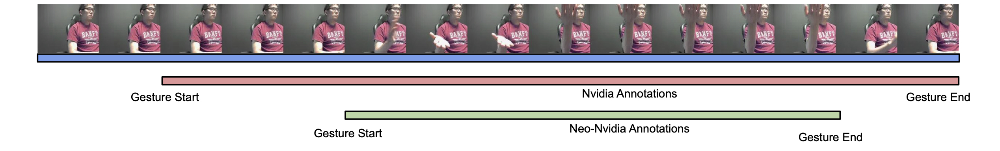

# Neo-Nvidia-Annotations
 
> [Progression Modelling for Online and Early Gesture Detection](https://arxiv.org/abs/1909.06672)  
> Vikram Gupta, Sai Kumar Dwivedi, Rishabh Dabral and Arjun Jain   
> Oral Paper, 3D Vision, 2019

This repository contains the tightly annotated **Neo-Nvidia annotations** contributed in our paper. In this paper, we propose a multi-task framework for online and early gesture recognition which is crucial for building touchless gesture bases interfaces. In the online settings, our approach recognises the gestures at an early stage with high precision and also achieves state-of-the-art results on the NVIDIA gesture dataset in the offline settings. We also evaluated our approach on the Montalbano dataset and report competitive results.

### Annotations

The annotations have been shared in json format. Each entry represents the annotation for a video from the NVIDIA dataset with the category "gesture_id" and the start/end frames "gesture_spans" for the gesture. Following is an example of the annotation.

> {  
> "gesture_spans":["85:106"],   
> "gesture_id":1,  
> "video_path":"class_01/subject2_r0"  
> }

Some videos have multiple gesture spans as multiple instances of the same gestures were performed in the video. 

### Acknowledgments
 
We thank Mallikarjun BR, Neha Tarigopula, Sanath Narayan and Shuaib Ahmed for their valuable feedback and their help in the annotation of the dataset. 

We gratefully acknowledge Brijesh Pillai and Partha Bhattacharya at Mercedes-Benz Research and Development India, Bangalore for providing the funding and infrastructure for this work.
  
### Questions and contributions
 
For any questions and contributions, you can contact the authors of the paper, whose
emails are listed in the paper.

**Disclaimer**: This is not an official Daimler product.
